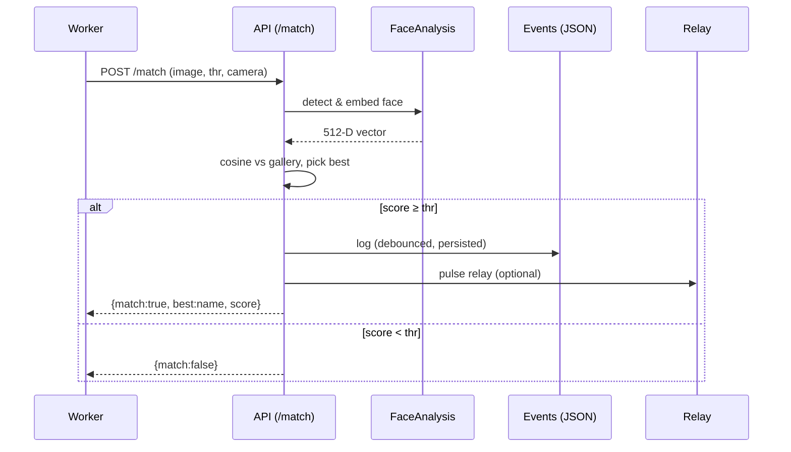

# Gym Face Detection & Access Control 🚪🤖

AI-powered face **detection**, **recognition**, and **access control** for gym entrances.  
Built with **FastAPI**, **InsightFace**, and **YOLO/RetinaFace**, designed to run locally and on **Jetson Orin Nano**.


---

## ✨ Features
- 🔍 **Face detection** (RetinaFace) + 🧠 **recognition** (InsightFace embeddings)
- 👤 **Enrollment** (`/enroll`) with 1–N images → robust template
- 🎯 **Matching** (`/match`) with cosine similarity & thresholding
- 🧾 **Event logging** (`/events`) with **debounce** (prevents duplicates) + **persistence**
- 📤 **CSV export** (`/events/csv`) and **clear** endpoint
- 🧪 **Swagger UI** at `/docs` for easy testing
- 🟢 **Access control-ready**: relay pulse on successful match (Jetson GPIO or HTTP relay)

---

## 🖼 System Overview

```mermaid
flowchart LR
    CAM[IP Camera (RTSP)] -->|frames → worker| WORKER[detector/folder_worker.py or rtsp_worker.py]
    WORKER -->|POST /match| API[(FastAPI: gym_api/app.py)]
    API -->|InsightFace| FACE[Embeddings + Cosine]
    API -->|log (debounced)| EVENTS[events.json]
    API -->|unlock (optional)| RELAY[GPIO/HTTP Relay]
    RELAY --> DOOR[Maglock/Strike]
```

### Match flow (simplified)


---

## 📦 Project Structure

```
gym-face-detection/
├─ gym_api/
│  └─ app.py               # FastAPI app (enroll, match, events, debounce, persistence)
├─ detector/
│  ├─ folder_worker.py     # "camera simulator" – sends images to /match
│  └─ run_local_retina.py  # local test: detect + crop + embed
├─ recognizer/
│  ├─ enroll.py            # build gallery templates from images
│  ├─ match.py             # compare embeddings (cosine)
│  └─ verify_pair.py       # A vs B sanity-check
├─ data/
│  ├─ embeddings/
│  │  ├─ gallery.json      # person → averaged embedding
│  │  └─ *.npy             # saved vectors (dev artifacts)
│  └─ events.json          # persisted events (server)
├─ samples/                # demo images (optional; small only)
├─ logs/                   # worker CSV logs (local only)
├─ requirements.txt
└─ README.md
```

---

## 🚀 Quickstart

### 1) Install
```bash
python3 -m venv .venv
source .venv/bin/activate
pip install --upgrade pip
pip install -r requirements.txt
```

### 2) Run the API
```bash
uvicorn gym_api.app:app --reload --host 0.0.0.0 --port 8000
```
- Health: `http://127.0.0.1:8000/health`  
- Docs: `http://127.0.0.1:8000/docs`

### 3) Enroll
```bash
curl -X POST "http://127.0.0.1:8000/enroll" \
  -F "name=marc" \
  -F "files=@samples/marc_1.jpg" \
  -F "files=@samples/marc_2.jpg"
```

### 4) Match
```bash
curl -X POST "http://127.0.0.1:8000/match?thr=0.45&camera=door-1" \
  -F "file=@samples/entry.jpg"
```

### 5) Events
```bash
curl -s http://127.0.0.1:8000/events | jq .
curl -s http://127.0.0.1:8000/events/csv -o events.csv
curl -s -X POST http://127.0.0.1:8000/events/clear
```

---

## 🧪 Dev Tools

- **Folder worker** (simulates a camera):
  ```bash
  python detector/folder_worker.py \
    --folder samples \
    --url http://127.0.0.1:8000 \
    --camera door-1 \
    --thr 0.45 \
    --interval 1.0 \
    --loop \
    --shuffle
  ```

- **Verify pair** (expect higher score for same person):
  ```bash
  python recognizer/verify_pair.py samples/marc_1.jpg samples/marc_2.jpg
  ```

---

## 🔑 Access Control (Jetson/Relay)

- Map `camera → door` and pulse a **GPIO relay** or **HTTP relay** on match.
- Safety: REX (request-to-exit) button in parallel, fail-safe maglock, local code compliance.

> See comments in `gym_api/app.py` for the `DOORS` config and `unlock_door()` helper.

---

## 🧠 How It Works (math)

- **Embeddings**: InsightFace produces a 512-D vector per face.  
- **Similarity**: Cosine similarity between query vector `q` and each gallery vector `gᵢ`.  
- **Decision**: `match = (maxᵢ cos(gᵢ, q) ≥ thr)`

```python
def cosine(a, b):
    an = a / (np.linalg.norm(a) + 1e-9)
    bn = b / (np.linalg.norm(b) + 1e-9)
    return float(np.dot(an, bn))
```

- **Debounce**: one event per `(person, camera)` within `N` seconds → cleaner logs.

---

## 📚 Learn the Theory (Szeliski, 2nd ed.)
- **Ch. 3** – Image processing (filters, pre-proc)
- **Ch. 7** – Segmentation & detection foundations
- **Ch. 9** – Recognition (features, similarity) ★
- **Ch. 11** – Deep learning architectures (CNNs/embeddings)
- **Ch. 13** – Tracking (for multi-camera expansion)

---

## 🗂 .gitignore (recommended)
```
.venv/
__pycache__/
*.pyc
.DS_Store
data/
logs/
samples/
*.npy
*.onnx
*.pt
*.env
```

> Keep demo images tiny if you include them; otherwise host examples externally.

---

## 🛣 Roadmap
- [ ] RTSP worker for live cameras
- [ ] GPIO/HTTP relay unlock + audit fields (granted/denied)
- [ ] Minimal dashboard (HTML/JS) polling `/events`
- [ ] Auth on `/match` & CORS hardening
- [ ] Jetson build (TensorRT/ONNX Runtime GPU)

---

## 📝 License
MIT © 2025 YOUR NAME
